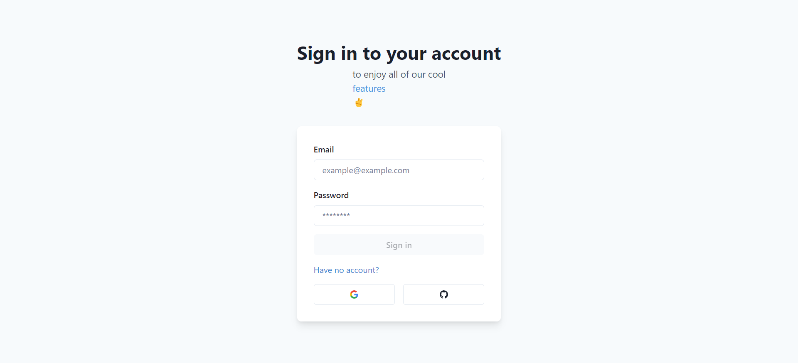
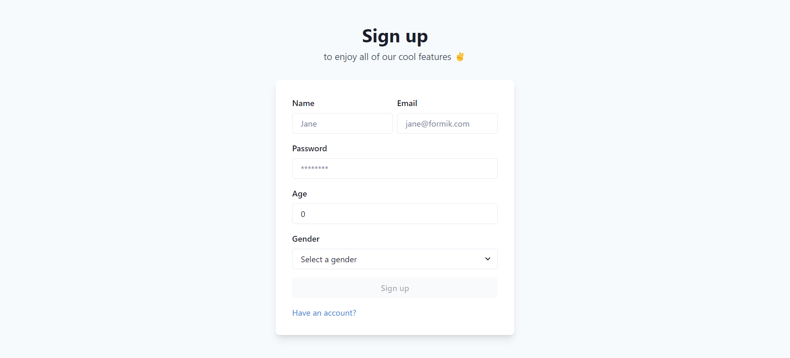
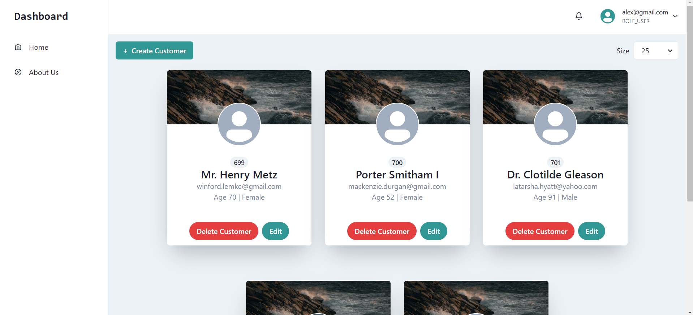
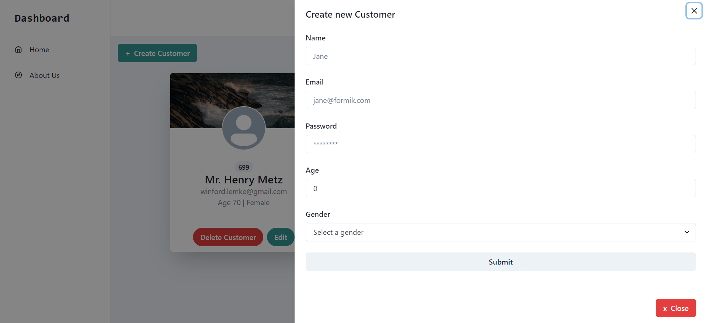
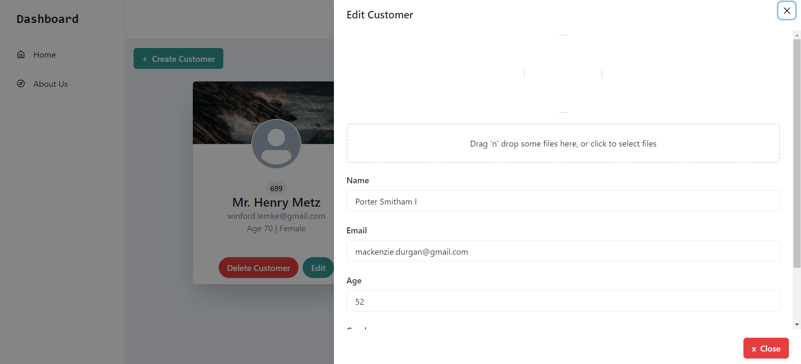
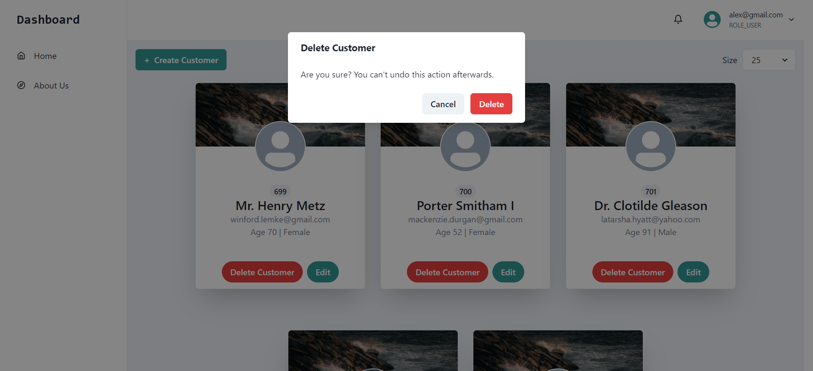

# User Manager Full Stack Web Application
___
This is a full stack web application that allows users to manage users (create, edit, delete). 
The application also allows users to login using Google, GitHub OAuth2.0 or custom authentication.
The application is built using `Java`, `Spring`, `JavaScript`, `React`, `PostgreSQL`, `Chakra UI` and many other technologies.
## Technologies
___
✅ Spring Boot 3  
✅ HTTP & API development  
✅ Developer tools for maximum productivity  
✅ Robust error handling techniques  
✅ Databases & PostgreSQL  
✅ Spring Data JPA  
✅ Flyway for seamless database migrations  
✅ JDBC for efficient database communication  
✅ Testing strategies for robust, reliable code  
✅ Docker for containerization and deployment  
✅ DevOps best practices for agile, collaborative development  
✅ JavaScript and React for front-end development  
✅ Spring Security 6 for secure, authenticated applications  
✅ Login/Registration systems for user management  
✅ OAuth 2.0 for authorization and authentication
## How does it look like
___
1. Sign in page

2. Sign up page 

3. Dashboard page

4. Create user drawer

5. Edit user drawer

6. Delete user popup

## Resources
___
+ [Spring Boot 3](https://spring.io/projects/spring-boot)
+ [React](https://reactjs.org/)
+ [PostgreSQL](https://www.postgresql.org/)
+ [Chakra UI](https://chakra-ui.com/)
+ [Docker](https://www.docker.com/)
+ [Java](https://www.java.com/en/)
+ [JavaScript](https://www.javascript.com/)
